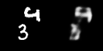
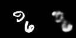
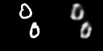

## Next-frame video prediction

> [WORK IN PROGRESS](TODO.md)

Practicing some neural networks for Next-Frame Video Prediction.

For the discipline of Multimedia Processing Systems (PGC302B) - 2023/1 UFU.

## Quick start

1. Create a [virtual environment](https://docs.python.org/3/library/venv.html):
```bash
python -m venv .venv
```

2. Activate it:
```bash
source .venv/bin/activate
```

3. Install dependencies:
```bash
pip install -r requirements.txt
```

4. Run:
```bash
jupyter notebook
```


## References

- [Next-Frame Video Prediction with Convolutional LSTMs](https://keras.io/examples/vision/conv_lstm/)
- [Convolutional LSTM Network: A Machine Learning Approach for Precipitation Nowcasting](https://arxiv.org/abs/1506.04214)
- [Convolutional, Long Short-Term Memory, fully connected Deep Neural Networks](https://ieeexplore.ieee.org/abstract/document/7178838)
- [Unsupervised Learning of Video Representations using LSTMs](https://arxiv.org/abs/1502.04681)
- [Deep Predictive Coding Networks For Video Prediction And Unsupervised Learning](https://arxiv.org/abs/1605.08104)
- [Predictive coding in the visual cortex: a functional interpretation of some extra-classical receptive-field effects](https://www.nature.com/articles/nn0199_79)


## Dataset

- [x] [Moving MNIST](https://www.cs.toronto.edu/~nitish/unsupervised_video/)

<!--
    
    
    
    
    
-->
